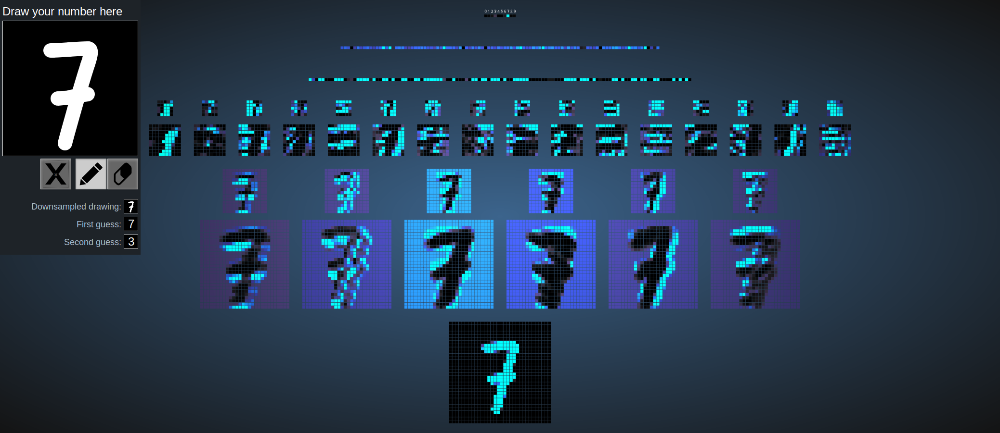
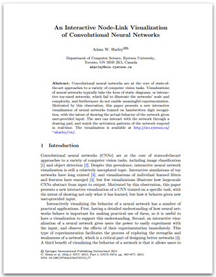
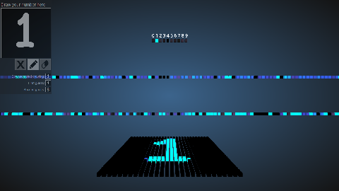
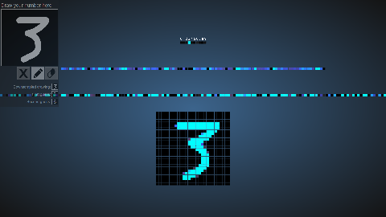
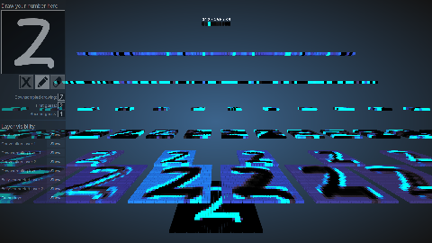

# An Interactive Node-Link Visualization of Convolutional Neural Networks

## Abstract
Convolutional neural networks are at the core of state-of-the-art approaches to a variety of computer vision tasks. Visualizations of neural networks typically take the form of static node-link diagrams, which illustrate only the structure of a network, rather than the behavior. Motivated by this observation, this project presents a new interactive visualization of neural networks trained on handwritten digit recognition, with the intent of showing the actual behavior of the network given user-provided input. The user can interact with the network through a drawing pad, and watch the activation patterns of the network respond in real time.

Paper PDF:

<a href="http://www.cs.cmu.edu/~aharley/vis/harley_vis_isvc15.pdf" rel="paper"></a>

Live demos (all available at [http://cs.cmu.edu/~aharley/nn_vis](http://cs.cmu.edu/~aharley/nn_vis)):

1. 3d visualization of a multi-layer perceptron:

   <a href="http://www.cs.cmu.edu/~aharley/nn_vis/mlp/3d.html" rel="mlp_3d"></a>

2. 2d visualization of a multi-layer perceptron:

   <a href="http://www.cs.cmu.edu/~aharley/nn_vis/mlp/2d.html" rel="mlp_2d"></a>

1. 3d visualization of a convolutional network:

   <a href="http://www.cs.cmu.edu/~aharley/nn_vis/cnn/3d.html" rel="cnn_3d"></a>

2. 2d visualization of a convolutional network:

   <a href="http://www.cs.cmu.edu/~aharley/nn_vis/cnn/2d.html" rel="cnn_2d"></a>


FAQ:

* Can I use this in my course/textbook/presentation?
  * Yes! Please just cite the work appropriately.
  
* How do I cite you?
  * Here is a plaintext citation:
  
    `A. W. Harley, "An Interactive Node-Link Visualization of Convolutional Neural Networks," in ISVC, pages 867-877, 2015`
  
    Here is a bibtex snippet:
    ```
    @inproceedings{harley2015isvc,
    title = {An Interactive Node-Link Visualization of Convolutional Neural Networks},
    author = {Adam W Harley},
    booktitle = {ISVC},
    pages = {867--877},
    year = {2015}
    }
    ```
    
* I tried to run the code locally, and I see classifications, but I do not see the network visualization.
  * This is probably related to json requests being blocked by something called `CORS policy`. The solution is to upload the code to a web address and run it from there, instead of running locally.
   